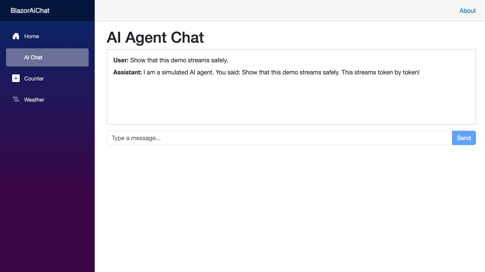

# Blazor WASM AI Chat with Microsoft.Extensions.AI

A companion code repository for the blog post: **[Building a Real-Time Blazor WASM AI Chat App with Microsoft.Extensions.AI](https://chrismalpass.net/posts/blazor-wasm-ai-chat-app-with-microsoft-agent-framework/)**.

This repository demonstrates a guarded, streaming AI application using **Blazor WebAssembly**, **Microsoft.Extensions.AI**, and .NET 10.

---

## 🚀 Architecture Highlights

- **Agent Gateway Pattern**: The Blazor WASM client communicates with an ASP.NET Core backend Minimal API, ensuring LLM API keys and credentials are never exposed in the browser.
- **Provider-Agnostic AI**: Implements Microsoft's new `IChatClient` abstraction, allowing seamless switching between OpenAI, Azure OpenAI, Anthropic, and local models (via Ollama) without changing business logic.
- **Browser Streaming**: Enables Blazor's browser response streaming as well as `HttpCompletionOption.ResponseHeadersRead`, then consumes the `IAsyncEnumerable<ChatResponseUpdate>` output from the gateway.
- **Bounded Gateway**: Limits conversation size, applies per-user/IP rate limits and a request timeout, emits safe operational telemetry, and requires JWT authentication outside Development.
- **UI Thread Safety**: Coalesces DOM re-renders to a 50 ms cadence during high-frequency token bursts and allows the user to cancel a response.

---

## 📸 Verified browser flow

The screenshot below is captured from the Playwright smoke test committed with this repository. The test starts the app, enters a prompt, observes the active streaming state, and verifies the completed response without configuring credentials.



The same test runs in GitHub Actions. Its successful screenshot is retained as the `browser-test-evidence` workflow artifact; failed runs include a trace as well, making browser failures inspectable instead of relying only on a pass/fail result.

---

## 📁 Solution Structure

- `BlazorAiChat/BlazorAiChat`: The ASP.NET Core backend server hosting the `/api/chat` streaming Minimal API endpoint and registering `IChatClient`.
- `BlazorAiChat/BlazorAiChat.Client`: The Blazor WebAssembly frontend containing the interactive chat UI (`Chat.razor`).

---

## 🛠️ Getting Started

### Prerequisites
- [.NET 10.0 SDK](https://dotnet.microsoft.com/download/dotnet/10.0)

### Running Locally
1. Clone the repository:
   ```bash
   git clone https://github.com/cmalpass/blazor-wasm-agent-chat.git
   cd blazor-wasm-agent-chat/BlazorAiChat
   ```

2. Run the application:
   ```bash
   dotnet run --project BlazorAiChat
   ```

3. Navigate to `https://localhost:7150/chat` (or the HTTP/HTTPS port shown in your terminal) and start chatting!

By default, the application runs with an in-memory `SimulatedChatClient` so you can test token streaming immediately without configuring external API keys. The local development launch profile also permits the chat endpoint anonymously; production always requires a JWT.

### Production authentication and limits

The demo allows anonymous access **only** in the `Development` environment so it remains runnable out of the box. In every other environment, `/api/chat` requires a validated JWT bearer token. Configure your identity provider through the standard `Authentication:Schemes:Bearer` configuration section, and send the resulting token from the client or a server-side BFF. Never put a provider API key or a long-lived JWT in the WebAssembly application.

The endpoint accepts at most 20 user/assistant messages, 4,000 characters per message, and 8,000 characters per conversation. Its sample per-user/IP rate limit is 10 requests per minute; tune it to the selected model, tenant plan, and infrastructure capacity. The app records activity and metrics without recording prompts or completions, ready for an OpenTelemetry exporter in the host.

### Testing

Run the deterministic gateway and component suite with:

```bash
dotnet test BlazorAiChat/BlazorAiChat.sln --configuration Release
```

The suite covers the simulated provider, gateway validation, the production authentication requirement, and bUnit component states.

To run the browser smoke test locally (the same flow used for the screenshot), install its isolated Node dependencies and Chromium once:

```bash
npm ci
npx playwright install chromium
npm run test:e2e
```

When no local instance is already running, the Playwright test starts the Development profile itself. It submits a prompt, verifies the visible streaming state and final response, and attaches a full-page screenshot to the test result. It validates the zero-config happy path; add provider-specific and identity-provider scenarios as you introduce them.

---

## 🔄 Switching to Ollama (Local AI)

To use a local Ollama model instead of the simulated client:

1. Install [OllamaSharp](https://github.com/awaescher/OllamaSharp):
   ```bash
   dotnet add BlazorAiChat/BlazorAiChat.csproj package OllamaSharp
   ```

2. Replace the `IChatClient` registration in `BlazorAiChat/Program.cs`:
   ```csharp
   using OllamaSharp;

   builder.Services.AddSingleton<IChatClient>(
       new OllamaApiClient(new Uri("http://localhost:11434"), "phi3"));
   ```

The Blazor WASM client requires zero code changes.

---

## 📜 License

This project is licensed under the [MIT License](LICENSE).
